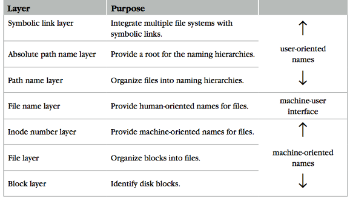

# Note of Lab1

## Part1
Part1 实现了文件系统的前三层：
* Block layer
* File layer
* Inode number layer
### Block layer
与课上讲的不同，这里的**superblock**和**bitmap**由给定的数据结构实现，而没有使用disk数组。
```C++
typedef struct superblock {
  uint32_t size;
  uint32_t nblocks;
  uint32_t ninodes;
} superblock_t;
struct superblock sb;
std::map <uint32_t, int> using_blocks;

```
不过后续在inode layer中仍然会象征性空出前面的一些block。
下面两个函数中会访问block数组，记得检查下标，这样的话整个lab基本不会出现segemetation fault。
```C++
void disk::read_block(uint32_t id, char *buf);
void disk::write_block(uint32_t id, const char *buf);
```
个人曾经因为block_manager::alloc_block和中的一些bug导致和inode_manager::write_file中inode_num的越界导致向这两个函数传了两个越界的block_id。:(
### File layer & Inode number layer
每个inode占据了1个block，里面可以存最多101个block_id，其中100个是指向data block的，最后一个指向了indirect block。一个indirect block可以存512/4=128个block_id，因此这个文件系统单个文件最大为512*(100+128) bytes。

可以先参考给出的这个函数实现，学一下怎么根据inode_number得到block_id(最前面空了一些)，以及讲block中的（char*)转换成（inode*）并读取相关数据。**read_block**函数读出来的buf是拷贝过的 ，不指向disk上的数据，可以放心改，最后要**write_block**写回去。
```C++
void
inode_manager::put_inode(uint32_t inum, struct inode *ino)
{
  char buf[BLOCK_SIZE];
  struct inode *ino_disk;

  // printf("\tim: put_inode %d\n", inum);
  if (ino == NULL)
    return;

  bm->read_block(IBLOCK(inum, bm->sb.nblocks), buf);
  ino_disk = (struct inode*)buf + inum%IPB;
  *ino_disk = *ino;
  bm->write_block(IBLOCK(inum, bm->sb.nblocks), buf);
}
```

Part1最难的部分是**read_file**和**write_file**。
```C++
void read_file(uint32_t inum, char **buf, int *size);
void write_file(uint32_t inum, const char *buf, int size);
```
建议先完成**read_file**，想明白数据是怎么在最多100+128个block上储存的。**write_file**需要考虑到原来文件和新文件的大小关系，如果新文件比原来小则不需要**alloc_block**，需要**free_block**；新文件比原来大的话需要**alloc_block**，不需要**free_block**。写完要确认一下indirect_block中的每个inode和自己这个inode本身都已经写进disk了,并且要更新inode中储存的indirect_block的inum。
## Part2
Part2 实现了文件系统的后四层，主要实现目录和symbolic_link。这部分比Part1 简单，不过一开始看fuse.cc感到很迷惑
### fuse.cc
```C++
struct fuse_lowlevel_ops fuseserver_oper;
fuseserver_oper.getattr    = fuseserver_getattr;
fuseserver_oper.statfs     = fuseserver_statfs;
fuseserver_oper.readdir    = fuseserver_readdir;
fuseserver_oper.lookup     = fuseserver_lookup;    fuseserver_oper.create     = fuseserver_create;
fuseserver_oper.mknod      = fuseserver_mknod;
fuseserver_oper.open       = fuseserver_open;
fuseserver_oper.read       = fuseserver_read;
fuseserver_oper.write      = fuseserver_write;
fuseserver_oper.setattr    = fuseserver_setattr;
fuseserver_oper.unlink     = fuseserver_unlink;
fuseserver_oper.mkdir      = fuseserver_mkdir;
```
中的**fuseserver_oper**定义可见
[fuse_lowlevel.h](https://sourceforge.net/u/noon/fuse/ci/ecd073bd7054c9e13516041e3ef930e39270c8df/tree/include/fuse_lowlevel.h) 中149行的**fuse_lowlevel_ops**。这里是通过头文件中定义的一堆函数指针完成接口与实现的绑定。这些函数的参数与返回值传递方式在[fuse.cc](./fuse.cc)中的comments里和[fuse_lowlevel.h](https://sourceforge.net/u/noon/fuse/ci/ecd073bd7054c9e13516041e3ef930e39270c8df/tree/include/fuse_lowlevel.h)中有说明。每个函数的第一个参数都是**fuse_req_t**类型，后面fuse_reply_err，fuse_reply_attr，fuse_reply_buf，fuse_reply_write，fuse_reply_create等函数需要这个参数来将返回值出传回去。通过阅读一些已经完成的函数可以方便理解。
```C++
fuseserver_lookup(fuse_req_t req, fuse_ino_t parent, const char *name)
{
    struct fuse_entry_param e;
    // In chfs, timeouts are always set to 0.0, and generations are always set to 0
    e.attr_timeout = 0.0;
    e.entry_timeout = 0.0;
    e.generation = 0;
    bool found = false;

     chfs_client::inum ino;
     chfs->lookup(parent, name, found, ino);

    if (found) {
        e.ino = ino;
        getattr(ino, e.attr);
        fuse_reply_entry(req, &e);
    } else {
        fuse_reply_err(req, ENOENT);
    }

}
```

part2-a是不需要改fuse.cc的，但是后面的b-d部分都是要改的，read\write
\mkdir\setattr等函数都没实现完。不知道为啥guide里面说“We have implemented all of those methods for you except for Symbol Link. So don't modify fuse.cc unless you want to implement Symbol Link.”。
### 目录
目录的实现挺自由的，反正就是给定一个目录类型的inode，储存空间最大为（128+100）*512 bytes，要实现一个key-value store来存 name-inode_num pair。我才用的方法是直接用'\0'来分割每一个元素，即整个inode读出来的buf构成为：name_str + '\0' + inode_num_str + '\0' + name_str + ...。反正查找文件是要顺序遍历整个目录的。删除目录里文件的时候可以直接把整个buf读出来然后string.erase()再写回。建议按照**readdir**, **lookup**, **mkdir**的顺序完成，因为有调用关系。
### Symbolic link
要在fuse.cc中加入两个函数并注册：
```C++
void fuseserver_symlink(fuse_req_t req, const char *link, fuse_ino_t parent, const char *name)；
void fuseserver_readlink(fuse_req_t req, fuse_ino_t ino)；
fuseserver_oper.readlink   = fuseserver_readlink;
fuseserver_oper.symlink    = fuseserver_symlink;
```
其中**fuseserver_symlink**是用来建立Symbolic link的，需要在parent目录下为原链接link简历名为name的链接。name对应的inode_num里储存link这个字符串。
**fuseserver_readlink**相当于杜雨inode_num中的内容，和文件读取是一样的。除此之外，还需要在
```C++
chfs_client::status getattr(chfs_client::inum inum, struct stat &st)；
```
中处理symlink的情况，和file的getattr基本一样，只要改一下：
```C++
st.st_mode = S_IFLNK | 0777;
```


