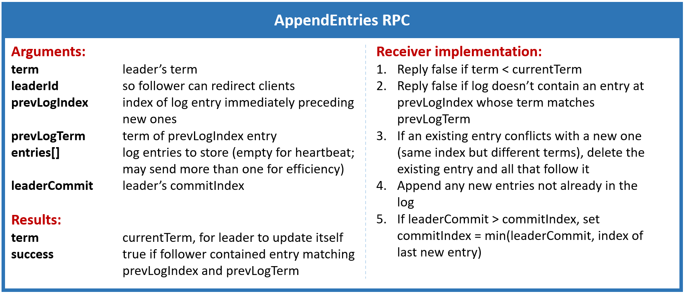

# Note of Lab3
Raft是比较难的一个lab，主要是第一次接触这么复杂的多线程程序。**Debug的思路非常重要，在关键状态改变的地方（比如开始选举，投票，成为leader, 添加log等）一定要打印一下相关的状态。** 因为跑一次测试可能时间非常长，而且可能会出现不能每次都复现的bug。下面先写几个我自己碰到的比较恶心的bug，然后再写几个关键点的实现方式。如果你还不理解关于选举leader时对于log的附加要求，以及为什么leader不能commit之前term的log，那么你需要先复习一下ppt或者raft papper。

因为加了snapshot之后会影响之前部分代码的可读性，所以这部分代码没有实现snapshot。
## Some tricky bugs
### Concurrency bug & mtx
我加了part3的persistance之后part2的concurrency部分fail了，后来发现是new_command函数没上锁。大部分的函数都是需要加锁的，同时尽量用std::unique_lock<std::mutex> lock(mtx) 来避免在某个return分支中忘记unlock。
### Idempotence of handle_append_entries_reply
碰到最麻烦的bug是因为append_entries失败后nextIndex[node]--造成了。如果run_background_commit的时间间隔比较小的话可能会存在server对一个follower发出了append_entries后的handle_append_entries_reply线程还没执行，就又进入了run_background_commit函数。这样的后果是同一个append_entries发了两次，handle_append_entries_reply也会执行两次，导致nextIndex多减了。因此，一方面要保证handle_append_entries_reply和append_entries操作的幂等性，一方面可以调大run_background_commit的执行间隔时间。这里出bug的话很可能在part3的测试体现出来，因为part3有crash，append_entries经常会fail。这个bug如果不是打印raft_log比较多的话是非常难找出来的。

## Sending commitIndex to followers in heartbeat
<div align=center>

</div>
append_entries要同时承担heartbeat, 同步log和同步commitIndex的功能，逻辑可能会写的非常复杂。我选择了在论文的基础上加了一条heartbeat变量,然后通过heartbeat来更新commitIndex。因为同步log的时候执行逻辑粉来救比较复杂，所以放到heartbeat里更优雅一些。
```c++
template <typename command>
class append_entries_args {
public:
    // Your code here
    bool heartbeat;
    int leaderCommitIndex;
    int term;
    int prevLogIndex;
    int prevLogTerm;
    std::vector<log_entry<command>> entries;
};
```

## Dealing with rollback in persisting log
如果要一个node的log和leader不一致是需要回退的。因此持久化log不仅需要append一个操作，还有可能修改之前的log。文件的随机读写总是很麻烦的，尤其是每个log的长度还不一定一样。好在raft的log比较有规律，修改中间的某条log的话他后面的log也就失效了。我采用了append only的方法，对每一条log多记录一个index:
```c++
template<typename command>
void raft_storage<command>::persistLog(log_entry<command> log, int index){
    mtx.lock();
    write(log_fd, &index, sizeof(int));
    write(log_fd, &log.term, sizeof(int));
    int size = log.cmd.size();
    write(log_fd, &size, sizeof(int));
    char *buf = new char [size];
    log.cmd.serialize(buf, size);
    write(log_fd, buf, size);
    delete buf;
    mtx.unlock();
}
```
然后restore的时候按照记录恢复就行了，每读一条记录就resize一下:
```c++
template<typename command>
void raft_storage<command>::restore(std::vector<log_entry<command>> &logs){
    mtx.lock();
    log_entry<command> empty;
    empty.term = 0;
    logs.push_back(empty);
    //restore meta data
    //......
    //restore logs
    int index;
    int size;
    int term;
    char *buf;
    while((n = read(log_fd, &index, sizeof(int))) == sizeof(int)){
        logs.resize(index + 1);
        read(log_fd, &term, sizeof(int));
        read(log_fd, &size, sizeof(int));
        buf = new char [size];
        if(read(log_fd, buf, size) != size)
            printf("Read error\n");
        log_entry<command> log;
        log.cmd.deserialize(buf, size);
        log.term = term;
        logs[index] = log;
    }
    mtx.unlock();
}
```
## Leader updating commitIndex
我把更新commitIndex的逻辑写在run_background_commit里，统计一遍可以更新的logIndex。如果最后一个可更新的logIndex的term是currentTerm的话就可以进行更新。（不理解为什么要有term这个条件的话要去看一下raft paper的figure 8）。
```c++
int lastCommitCandidateIndex = commitIndex + 1;
for(; lastCommitCandidateIndex < logs.size(); ++lastCommitCandidateIndex){
    int commitNodeNum = 1;
    for(int i = 0; i < node_num; ++i){
        if(i != my_id && matchIndex[i] >= lastCommitCandidateIndex) ++commitNodeNum;
    }
    if(commitNodeNum <= node_num / 2){
        break;
    }
}
--lastCommitCandidateIndex;
if(lastCommitCandidateIndex > commitIndex && logs[lastCommitCandidateIndex].term == currentTerm){
    commitIndex = lastCommitCandidateIndex;
    RAFT_LOG("leader commit logs to %d", commitIndex);
}
```

## Avoid votes split
除了对应heartbeat的append_entries之外，还要在candidate发起投票后和follower给candidate投票后进行更新last_received_rpc_time。每个node的timeout可以不用像原文那样用随机数，可以根据node_id排序：
```c++
if(role == follower && getCurrentTime() - last_received_RPC_time > 300 + 200 * my_id /  node_num){
    RAFT_LOG("start_election");
    last_received_RPC_time = getCurrentTime();
    role = candidate;
    ++currentTerm;
    voteFor = my_id;
    storage->persistMeta(currentTerm, voteFor);
    receive_vote_cnt = 1;
    request_vote_args args;
    args.candidate_id = my_id;
    args.term = currentTerm;
    args.lastLogTerm = logs.back().term;
    args.lastLogIndex = logs.size() - 1;
    for(int i = 0; i < node_num; ++i){
        if(i == my_id) continue;
        thread_pool->addObjJob(this, &raft::send_request_vote, i, args);
    }
}
```
竞选成功后需要立即发出heartbeat。

## Optimization on log matching is unneccesary
我一开始也考虑过同步log失败后只回退一次nextIndex是不是效率有点低，后来发现raft paper讨论了这个问题：
"If desired, the protocol can be optimized to reduce the number of rejected AppendEntries RPCs. For example, when rejecting an AppendEntries request, the follower can include the term of the conflicting entry and the first index it stores for that term. With this information, the leader can decrement nextIndex to bypass all of the conflicting entries in that term; one AppendEntries RPC will be required for each term with conflicting entries, rather than one RPC per entry. In practice, we doubt this optimization is necessary, since failures happen infrequently and it is unlikely that there will be many inconsistent entries."
因为失败的情况比较少，因此做优化的话代码会复杂很多，也更容易写错。