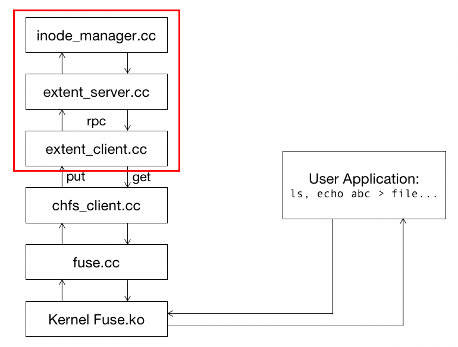
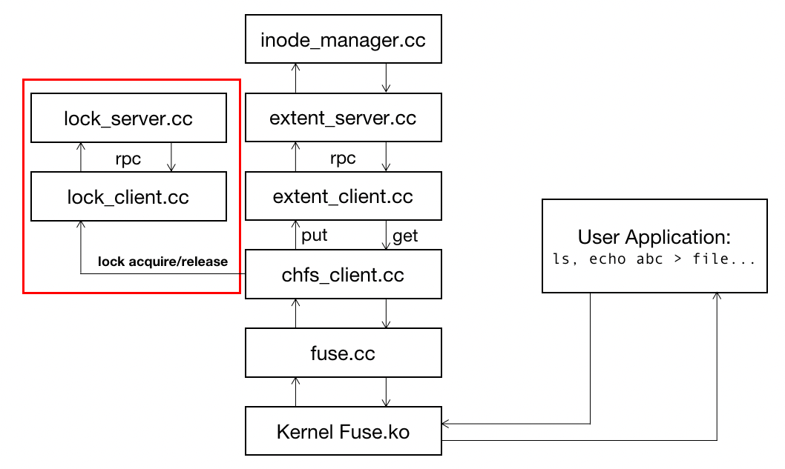

# Note of Lab2B
实现了多个client对fs server的并发访问。因为目前server只有一台，所以server上的create, put, get, remove, getattr不用考虑冲突问题，互相之间事不回并行的。跟Lab2A无关，相关代码可以先comment掉。
## Part1 RPC

client变成用rpc调用server的函数了。仔细阅读demo，学会rpc库的用法。最终只要在extent_client里加几行代码，server端的注册在extent_smain里已经有了。

## Part2 Lock Server

一个提供lock服务的server,需要先复习一下ics3里的mutex和conditional variable。代码量也很少。跑lock_tester之前记得先运行lock_server，我在这debug了很久 :(

## Part 3: Locking
用lock server解决多个client同时访问server的冲突问题。写的时候不要无脑加锁，单个读操作是不需要的。因为一个操作对应一个inode，只需要一把锁，所以正常情况不会死锁，除非拿锁过后又调用了需要拿锁的函数。写这个部分的时候testb挂了，debug发现居然是lab1的时候mkdir漏写了一个get，而前面的test case没覆盖在一个非空目录下mkdir的场景。。